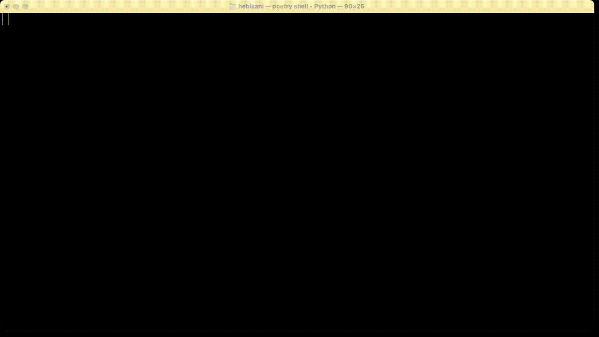

.. image:: https://img.shields.io/endpoint?url=https://gist.githubusercontent.com/ajite/c90a126b4e926b94c07a36ac78e9a9ad/raw/hebikani_coverage.json
	:target: https://github.com/ajite/hebikani
	:alt: Coverage

.. image:: https://readthedocs.org/projects/hebikani/badge/?version=latest
	:target: https://hebikani.readthedocs.io/en/latest/?badge=latest
	:alt: Documentation Status

HebiKani
============

**This program is not an official WaniKani client. Use at your own risk.**

A command line interface to do your WaniKani lessons and reviews.

INSTALL
-------

.. code-block:: bash

    pip install hebikani

If you are missing libraries check the  `documentation <https://hebikani.readthedocs.io/en/latest/install.html>`_

RUN
---

Check the help:

.. code-block:: bash

    hebikani --help

To display your review summary:

.. code-block:: bash

    hebikani summary

To start a review session:

.. code-block:: bash

    hebikani reviews

To start a review session in hard mode with audio and a limited number of reviews:

.. code-block:: bash

    hebikani reviews --hard --autoplay --limit 10

DEVELOPMENT
-----------
This project uses `Poetry <https://python-poetry.org/docs/>`_.

.. code-block:: bash

    poetry install

You can also use the generated `requirements.txt` file.

.. code-block:: bash

    pip install -r requirements.txt

Please run that command after adding external libaries through poetry:

.. code-block:: bash

    poetry export --without-hashes --format requirements.txt --output requirements.txt

TEST
----

Run the test:

.. code-block:: bash

    poetry run pytest
