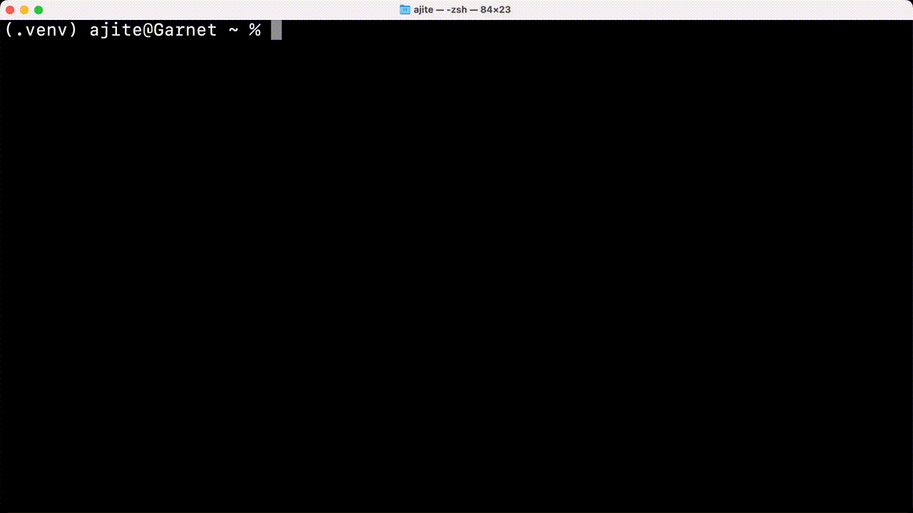

.. WaniKani CLI documentation master file, created by
   sphinx-quickstart on Thu May 19 15:24:03 2022.
   You can adapt this file completely to your liking, but it should at least
   contain the root `toctree` directive.

Welcome to WaniKani CLI's documentation!
========================================

**WaniKani CLI** is an unofficial python CLI to do your lessons and reviews on WaniKani.

This app is still in development, so please report any bugs or feature requests on the `GitHub repository`_

.. _GitHub repository: https://github.com/ajite/wanikani-cli

.. toctree::
   :maxdepth: 2
   :caption: Contents:

   install
   contributing
   cli

Indices and tables
==================

* :ref:`genindex`
* :ref:`modindex`
* :ref:`search`
